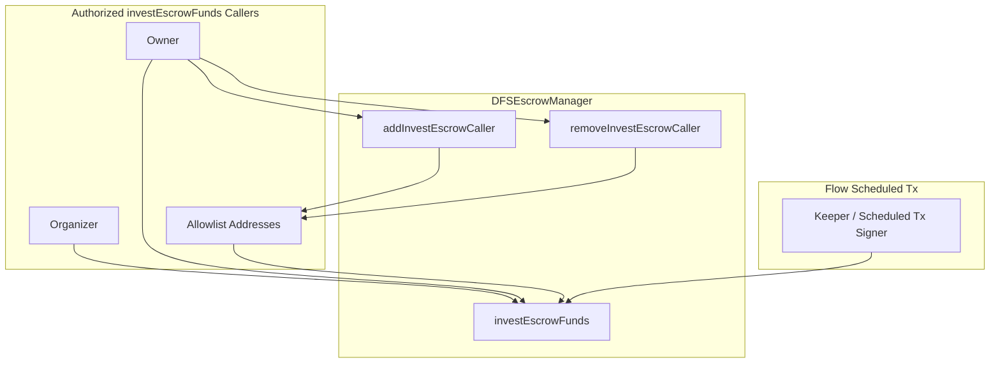

# Invest Escrow Allowlist Implementation

## Summary

Add an allowlist so that addresses other than the organizer or owner can call `investEscrowFunds`. This enables Flow scheduled transactions (or keeper bots) to invest funds automatically without a Firebase backend. Only the contract deployer (owner) can manage the allowlist.

---

## 1. Contract Changes ([contracts/DFSEscrowManager.sol](contracts/DFSEscrowManager.sol))

### State and events

- Add `mapping(address => bool) public investEscrowCallerAllowlist;`
- Add events: `InvestEscrowCallerAdded(address indexed caller)`, `InvestEscrowCallerRemoved(address indexed caller)`
- Optionally add error `NotAuthorizedToInvest()` for clarity (or keep `NotOrganizerOrOwner`; the condition expands to include allowlist)

### Access control update in `investEscrowFunds` (line 340)

Replace:

```solidity
if (msg.sender != escrow.organizer && msg.sender != owner()) revert NotOrganizerOrOwner();
```

With:

```solidity
bool canInvest = msg.sender == escrow.organizer || msg.sender == owner() || investEscrowCallerAllowlist[msg.sender];
if (!canInvest) revert NotOrganizerOrOwner();
```

(Keeping `NotOrganizerOrOwner` avoids a breaking change; alternatively introduce `NotAuthorizedToInvest` for clearer semantics.)

### Owner-only allowlist management

Add two functions (place near `addAuthorizedCreator` / `removeAuthorizedCreator` around lines 622–636):

- `addInvestEscrowCaller(address _caller) external onlyOwner` — sets `investEscrowCallerAllowlist[_caller] = true`, emits `InvestEscrowCallerAdded`
- `removeInvestEscrowCaller(address _caller) external onlyOwner` — sets `investEscrowCallerAllowlist[_caller] = false`, emits `InvestEscrowCallerRemoved`

---

## 2. Local Tests ([test/DFSEscrowManager.ts](test/DFSEscrowManager.ts))

### New tests

1. **Allowlisted caller can invest**
  - Add `outsider` (or a new signer) to the allowlist via `addInvestEscrowCaller`.  
  - Create escrow, join, advance time past `endTime`.  
  - Call `investEscrowFunds(1)` as the allowlisted address.  
  - Assert success and that `invested == true`, `principalInvested` is correct.
2. **Non-allowlisted outsider still reverts**
  - Keep existing test at lines 299–301: outsider reverts with `NotOrganizerOrOwner`.  
  - Ensure it still passes (no allowlist entry for outsider).
3. **Owner can add/remove allowlist**
  - Owner adds address, verifies `investEscrowCallerAllowlist(addr) == true`.  
  - Owner removes address, verifies `investEscrowCallerAllowlist(addr) == false`.
4. **Removed allowlist caller cannot invest**
  - Add caller, then remove.  
  - Call `investEscrowFunds` as that caller; expect revert.

### Fixture update

- In `deployFixture`, optionally add a dedicated "keeper" or "investCaller" signer for allowlist tests.

---

## 3. Deploy Script ([scripts/deploy_dfs_escrow_manager_testnet.ts](scripts/deploy_dfs_escrow_manager_testnet.ts))

- After `addAuthorizedCreator`, add optional step: if `process.env.TESTNET_INVEST_CALLER_ADDRESS` is set, call `addInvestEscrowCaller(process.env.TESTNET_INVEST_CALLER_ADDRESS)`.
- Log whether an invest caller was added.
- Document in README: `TESTNET_INVEST_CALLER_ADDRESS` (optional) — address allowed to call `investEscrowFunds` (e.g., Flow scheduled tx keeper).

---

## 4. Testnet Flow (no script changes required)

The existing scripts already work:

- **prepare** — organizer creates escrow and joins (unchanged).
- **invest** — uses `ethers.getSigners()[0]` (DEPLOYER_PRIVATE_KEY). If that signer is the organizer, it works as today. If it is an allowlisted keeper, it also works.
- **settle** — organizer calls `divestAndDistributeWinnings` (unchanged).

To test the allowlist path on testnet:

1. Set `TESTNET_INVEST_CALLER_ADDRESS` to the keeper/scheduled-tx address before deploy.
2. Run deploy: `npm run deploy:dfs:testnet:phase2`.
3. Run prepare: `npm run test:flowTestnet:prepare`.
4. Wait ~1 hour.
5. Run invest using the keeper’s key (e.g., `KEEPER_PRIVATE_KEY` in `.env` and a script that uses it for the invest step), or keep using organizer key if organizer is also the deployer.

If you prefer to keep using the organizer for invest during testing, leave `TESTNET_INVEST_CALLER_ADDRESS` unset; organizer and owner continue to work.

---

## 5. Deployment and Testnet Verification

1. **Redeploy** — Contract changes require redeploy: `npm run deploy:dfs:testnet:phase2`.
2. **Update `.env`** — Set new `TESTNET_DFS_ESCROW_MANAGER_ADDRESS` from deploy output.
3. **Run lifecycle** — `prepare` → wait 1 hour → `invest` → `settle:combined`.
4. **Optional allowlist test** — Add keeper to allowlist at deploy, then run `invest` with keeper key to confirm allowlisted path.

---

## Architecture Diagram




---

## Files to Modify


| File                                                                                         | Changes                                                                                                              |
| -------------------------------------------------------------------------------------------- | -------------------------------------------------------------------------------------------------------------------- |
| [contracts/DFSEscrowManager.sol](contracts/DFSEscrowManager.sol)                             | Add allowlist mapping, events, `addInvestEscrowCaller`, `removeInvestEscrowCaller`, update `investEscrowFunds` check |
| [test/DFSEscrowManager.ts](test/DFSEscrowManager.ts)                                         | Add 4 tests: allowlisted caller invests, outsider reverts, owner add/remove, removed caller reverts                  |
| [scripts/deploy_dfs_escrow_manager_testnet.ts](scripts/deploy_dfs_escrow_manager_testnet.ts) | Optional `addInvestEscrowCaller` when `TESTNET_INVEST_CALLER_ADDRESS` is set                                         |
| [README.md](README.md)                                                                       | Document `TESTNET_INVEST_CALLER_ADDRESS` in optional env vars                                                        |


